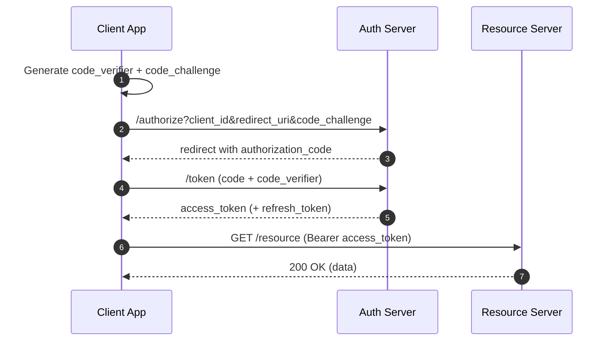
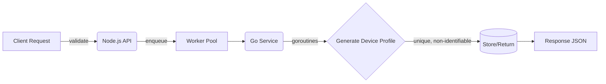

<!-- Profile README: Yaqoob Zahoor Ahmed -->

<!-- Header / Hero -->
<p align="center">
  
</p>

<p align="center">
  <a href="https://github.com/yzahmed"></a>
</p>

---

## 👋 About Me
I’m **Yaqoob Zahoor Ahmed**, a **full-stack developer** who enjoys building **clean APIs, scalable services, and developer tools**. My focus is on designing systems that are **secure, reliable, and efficient**, while keeping productivity and simplicity at the forefront.  

- 🔧 **Core Stack:** C#, JavaScript/TypeScript, React, Node.js, Go (Golang)  
- 🗄️ **Data:** SQL (MySQL, SQL Server, PostgreSQL), NoSQL (MongoDB, Firebase)  
- ☁️ **Infra:** Docker, Kubernetes, Proxmox, CI/CD basics  
- 🧭 **Design:** UML (Mermaid), SDLC (Agile/Iterative), API-first  
- 🛡️ **Focus:** Security, reliability, compliance, developer productivity  

---

## 🚀 Featured Projects

### Device Generator for Testing & Debugging · <sub><sup>*Node.js, Go, Express, Concurrency*</sup></sub>
Generates **realistic (non-identifiable)** device profiles for cross-platform testing. Exposes a **simple REST API** so teams can request devices without reinventing generators.  
- ⚙️ Node/Express validation → Go microservice with **goroutines + worker pools**  
- ♾️ Practically **indefinite unique** combinations, crafted to pass system checks  
- 🎯 Ideal for automated testing, mobile-on-desktop emulation, and QA environments  

```http
POST /api/devices
Content-Type: application/json

{ "platform": "android", "locale": "en-CA" }
```

---

### Secure Authentication URL Generator · <sub><sup>*OAuth2, PKCE, Node.js*</sup></sub>
Builds **specialized auth URLs** accepted by enterprise-scale apps; returns valid **authorization codes** for secure login flows.  
- 🔐 Covers **PKCE**, redirect URIs, and token exchange  
- 🧪 Helps validate client configs and auth edge cases  

---

### MultiStore Order Management System · <sub><sup>*MySQL*</sup></sub>
Relational design with **triggers, views, and stored procedures** to automate operations across two collaborating stores.  
- ✅ Normalization, constraints, integrity checks  
- 📊 Reusable scripts + clear reporting queries  

---

### BootCampCool – Fan Control App · <sub><sup>*C#*</sup></sub>
Windows desktop utility for Bootcamped MacBooks.  
- 🌡️ Manual/auto fan control, high-temp alerts  
- 📝 CSV logging, tray/background mode  
- 🧱 Event-driven, OOP-focused design  

---

### TxtMaster – Text Automation Utility · <sub><sup>*JavaScript, Node.js*</sup></sub>
Productivity toolkit for **text transformation** and batch formatting with a modular rules engine.  

---

### Tax Calculator Chrome Extension · <sub><sup>*JavaScript, Chrome APIs*</sup></sub>
In-page **real-time** tax calculations during online transactions with DOM parsing and configurable rules.  

---

### Markdown Portfolio · <sub><sup>*React, Node.js*</sup></sub>
A clean, responsive portfolio powered by Markdown content + React components.  
🔗 Live: https://yzahmed.github.io/markdown-portfolio/  

---

## 🧠 I Think in Diagrams (Mermaid)

### Auth (PKCE) Sequence



### Device Generation (High-Level)



---

## 🧰 Toolbox
**Languages/Frameworks:** C#, JavaScript/TypeScript, React, Node.js, Go, Java (learning), Python (basic)  
**Databases:** MySQL, SQL Server, PostgreSQL, MongoDB, Firebase  
**Infra:** Docker, Kubernetes, Proxmox, Oracle Cloud (Free Tier)  
**Design & Process:** UML (Mermaid), SDLC (Agile/Iterative), OAuth2/PKCE  
**Other:** Git/GitHub, Visual Studio, VS Code, Figma, MS Office  

---

## 📊 GitHub at a Glance
<p align="left">
  
  
</p>
