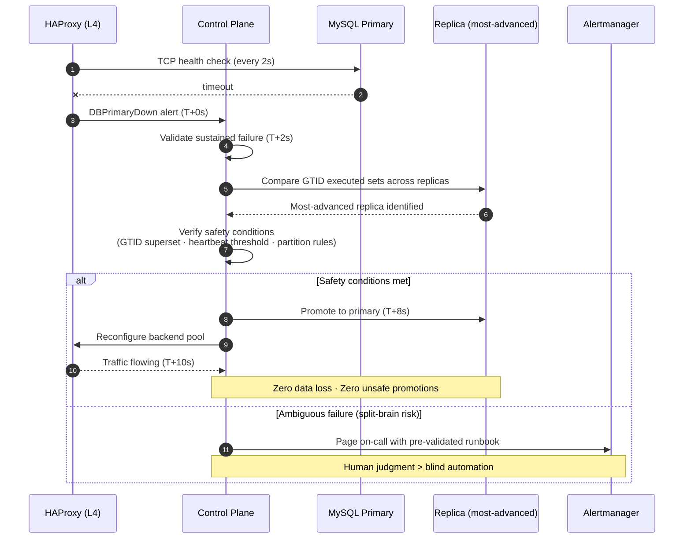
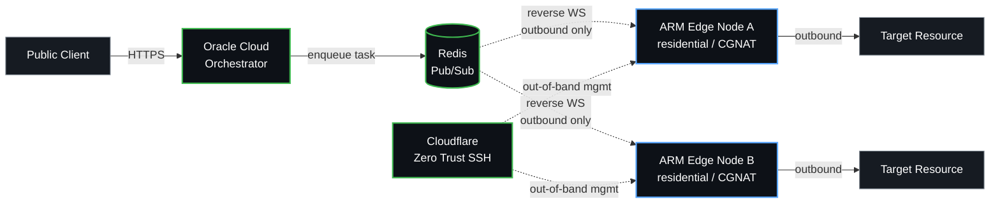

<!-- GitHub Profile README · Yaqoob Ahmed · Site Reliability Engineer & Systems Engineer -->

  

  
  
  
  

  
  
  
  

  
  

---

## `$ whoami`

I'm an SRE / systems engineer who builds production systems from first principles — **automated incident response, edge compute networks, applied cryptography**. The kind of work that runs unattended, has to recover when no one's watching, and where the test suite *is* the spec.

I read the actual specs, not the blog posts. Most of what I work on doesn't have a tutorial, so I trace syscalls, decompile binaries, and read kernel docs at odd hours until I understand what the system is *actually* doing — and then I implement against that understanding.

A few patterns that show up across my work:

- **Correctness over expedience.** GTID-based replication, not "good enough" binlog position; cross-runtime parity validated against thousands of test vectors; safety-governed automation that pages a human before it does something dangerous.
- **Designing around constraints, not fighting them.** Reverse WebSocket tunneling because residential CGNAT is permanent; KV-only hot paths because cold-start latency is non-negotiable; broker-blind encryption because trust in third-party infrastructure shouldn't be load-bearing.
- **Hand-built, end-to-end.** Vanilla HTML/CSS portfolios, scratch Docker images, custom systemd units, kernel sysfs hooks. If I can build it without a framework, I usually do.

---

## `$ ls -la /projects`

> Engineering write-ups with full architecture diagrams live at **[yaqoobahmed.com/#projects](https://yaqoobahmed.com/#projects)**. Repos below; the portfolio is the deeper read.

### ▸ Self-Healing SRE Trading Platform · `Featured`
> Kubernetes (K3s, GKE) · Apache Kafka · MySQL GTID · HAProxy · Terraform · Ansible · HashiCorp Vault · Prometheus · Grafana · Chaos Engineering

Production-grade SRE platform: hybrid cloud (Proxmox + GCP), three-tier architecture, automated MySQL failover via GTID set comparison, and a **safety-governed incident control plane** that refuses to promote a replica unless it can prove the promotion is safe. Chaos-validated against process kills, network partitions, broker eviction, and Vault seals.

`<10s` automated DB failover · `~70%` MTTR reduction · `99.9%` SLO target · `0` unsafe promotions · alert-correlation reduces noise without losing signal

[Repo](https://github.com/YZAHMED/sre-trading-simulator) · [Deep dive →](https://yaqoobahmed.com/projects/sre-trading-platform)

---

### ▸ Distributed Cryptographic Signing & Token Platform · `Anonymised`
> Go · Node.js · TypeScript · C# (reference) · GCP Cloud Run · GCP Cloud Functions · Cloudflare Workers · Firebase Auth · Stripe

A multi-runtime implementation of an **undocumented proprietary authentication protocol**, built byte-for-byte against the reference C# binary across Go, Node.js, and TypeScript runtimes. Includes a serverless deployment, a Cloudflare Workers JWT gateway with Firebase JWKS verification at the edge, and a KV-backed Stripe subscription state machine with no origin server.

`2,000+` cross-runtime test vectors at 100% pass · `byte-for-byte` parity vs reference implementation · `PBKDF2 · AES-CBC · HMAC-SHA256 · ECDSA P-256` from spec, no library shortcuts · sub-millisecond per-token generation in Go · ships as a 12 MB scratch image

[Deep dive →](https://yaqoobahmed.com/projects/cryptographic-signing-platform) · [Edge gateway →](https://yaqoobahmed.com/projects/edge-api-gateway) · [Go performance generator →](https://yaqoobahmed.com/projects/go-device-generator)

---

### ▸ TLS Certificate Chain Inspector · `Live`
> Node.js · Netlify Functions · X.509 · OCSP · CRL · SPKI Pinning · Multi-Trust-Store Comparison

Cryptographic chain validation, not just expiry checks: child→parent signature verification, OCSP revocation, CRL parsing, side-by-side comparison against Mozilla / Apple / Google / system trust stores, SPKI hashes for pinning. Built after a real incident where a "valid" certificate chain wasn't actually trusted by every relying party.

[**Live → ssl.yaqoobahmed.com**](https://ssl.yaqoobahmed.com) · [Deep dive →](https://yaqoobahmed.com/projects/tls-certificate-inspector)

---

### ▸ X.509 Encryption Service · `Live`
> Node.js (ESM) · Netlify Functions · RSA-OAEP · Self-signed CA + server certs · node-forge

End-to-end RSA encryption demo deployed serverless. Self-signed CA → server cert chain, application-level RSA-OAEP on top of TLS, ESM/CommonJS interop in a bundled serverless target. A small project that exists because I wanted to *fully* understand PKI rather than rely on it.

[**Live → encryption.yaqoobahmed.com**](https://encryption.yaqoobahmed.com)

---

### ▸ Hardware-Backed Key Attestation — Security Research · `Anonymised`
> Android Keystore · setAttestationChallenge · X.509 attestation chains · JADX · mitmproxy

Reverse-engineering analysis of a production Android app's attestation flow. Documented a critical finding: the device-identity field used throughout the attestation flow is **not cryptographically bound to the hardware-backed attestation certificate chain**, breaking the trust model in multi-tenant device scenarios. Methodology, vulnerability writeup, and remediation suggestions documented end-to-end.

---

### ▸ Global Egress Orchestration · `In Progress`
> Node.js · Dart · Redis · Cloudflare Zero Trust · Reverse WebSocket · ARM thermal/sysfs tuning · Headless ops

Residential ARM nodes tunneled to Oracle Cloud over reverse WebSocket. **Zero inbound ports, zero static IPs, zero hardware deaths**. CGNAT is treated as a constraint of the physical world, not an obstacle to defeat — out-of-band management is via Cloudflare Zero Trust SSH, not port-forwarded admin panels.

[Deep dive →](https://yaqoobahmed.com/projects/global-egress-orchestration)

---

### ▸ The Pocket Data Center · `Bare Metal`
> PostmarketOS · Docker on ARM64 · 4-watt power envelope · Kernel sysfs · ALSA · ModemManager · systemd

Wiped Android off a OnePlus 6, flashed PostmarketOS, ran a full Docker stack on ARM64 at 4 watts. **Battery charge limits via raw `/sys/class/power_supply` writes**, SSD on OTG for database I/O, SMS gateway through the Qualcomm modem (`mmcli`), ALSA routing for live cellular calls, custom systemd units for everything. The hardware costs less than a month of cloud.

[Deep dive →](https://yaqoobahmed.com/projects/oneplus6-linux-server)

---

### ▸ End-to-End Encrypted MQTT Gateway
> Node.js · MQTT.js · AES-256-CBC · Broker-Blind E2E

The broker is **structurally blind to payload content**. AES-256-CBC at the publisher, ciphertext through Mosquitto, decrypt at the subscriber. Routing and reliability without trusting the broker's confidentiality — useful when the broker is operated by someone whose threat model isn't yours.

[Deep dive →](https://yaqoobahmed.com/projects/iot-mqtt-gateway)

---

### ▸ This Portfolio Site
> Vanilla HTML / CSS / Vanilla JS · Cloudflare Pages · No frameworks · No trackers · Lighthouse-perfect

Hand-built [yaqoobahmed.com](https://yaqoobahmed.com): single 23 KB CSS file, 50 bytes of JS for theme + year update, fluid typography, AAA contrast, semantic HTML, full security headers (HSTS preload, CSP, COOP, Permissions-Policy, X-Frame-Options), structured-data graph (Person + WebSite + Project + BreadcrumbList), inline SVG favicon and OG card. Footer says "no frameworks, no trackers" because the source proves it.

---

## `$ ./architecture --diagrams`

> A picture is worth a thousand words. So is `kubectl describe`. I do both.

### Incident Control Plane — Safety-Governed Failover

### Edge Egress — Reverse Tunnels Through CGNAT

---

## `$ cat ~/.toolbox`

### Orchestration & Infrastructure

### Reliability & Observability

### Cloud & Edge

### Backend

### Data & Messaging

### Security & Cryptography

### Networking, Analysis & RE

---

## `$ uptime --github`

  
  

  

---

## `$ contact --how-to-reach`

|   |   |
|---|---|
| **Portfolio** | [yaqoobahmed.com](https://yaqoobahmed.com) — engineering write-ups + architecture diagrams |
| **Resume** | [yaqoobahmed.com/resume](https://yaqoobahmed.com/resume) — PDF + HTML |
| **Email** | [work@yaqoobahmed.com](mailto:work@yaqoobahmed.com) |
| **Live: TLS Inspector** | [ssl.yaqoobahmed.com](https://ssl.yaqoobahmed.com) — full chain validation |
| **Live: X.509 Encryption** | [encryption.yaqoobahmed.com](https://encryption.yaqoobahmed.com) — RSA-OAEP demo |
| **GitHub** | [@yzahmed](https://github.com/yzahmed) |
| **Status** | Open to remote / global relocation · prefer reliability-first teams |

> I work best in environments where reliability is treated as an engineering discipline, not an afterthought.

---

  <code>yaqoob@ahmed:~$ logout</code> 
  <code>exit 0</code> · no frameworks, no trackers · © 2026 Yaqoob Ahmed

